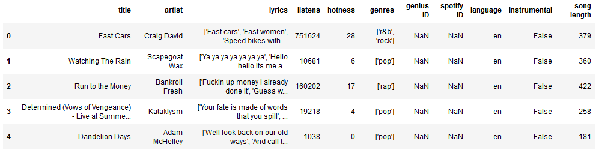
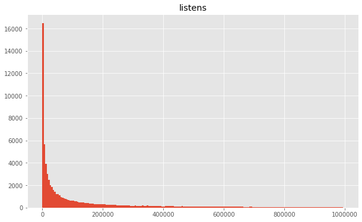
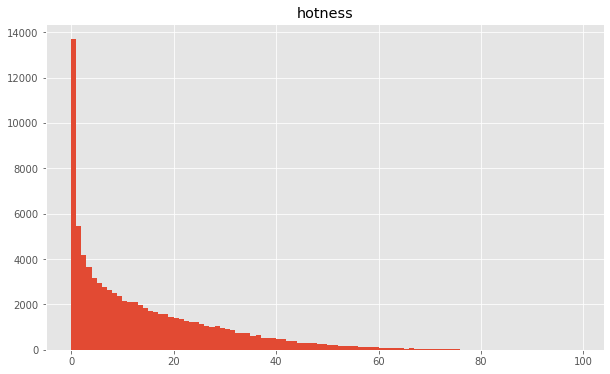
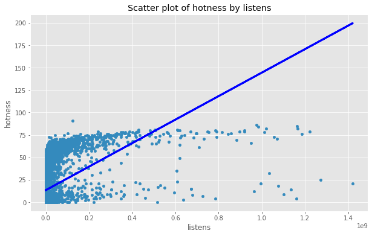
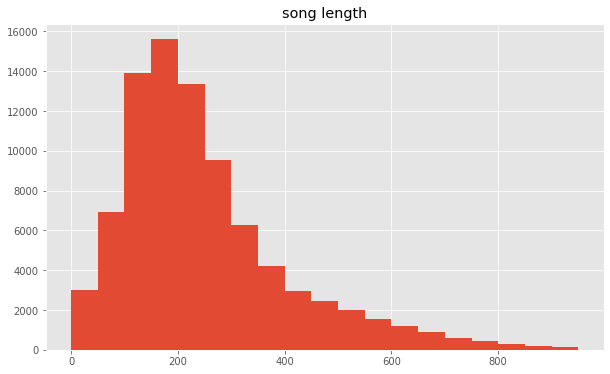

# Lyrical Analysis by Popularity 

### Contributors
Tanner Sims: u1159642, tannerjeffreysims@gmail.com
 
Ethan Burrows: u1102916, ethandburrows@gmail.com
 
Lass Omar: u1179231, u1179231@utah.edu
 

## Introduction 
Can AI beat the music industry? The music industry is heavily invested in decoding what makes a popular song, and the ability to predict popularity would be invaluable. But is it doable? What about a song makes it popular. Modern deep learning models may be able to answer that question.

We believe that lyrics are an important aspect of a song, and that a portion of the popularity of a song will stem from the lyrics. Our project uses modern transformer networks and RNNs to predict the popularity of a song, given only the lyrical content. Further, we will attempt to generate specific models which predict the popularity of a song by lyrics within genres. By analyzing genres and their lyrics, we can make predictions about the importance of lyrics within that genre. Finally, we hope to identify good and bad sections within the lyrics using the fully trained models.

### Background
The past 5 years have seen an explosion in the capabilities of deep networks in the application of natural language tasks. These models account for all of the recent advances in technology like Siri, Amazon’s Alexa, and even Google translate. After moving to deep learning, Google translate saw a sudden and large improvement, especially with difficult to translate or obscure languages.

Recent models, such as Google’s BERT and the Open-AI GPT-2, have consistently passed turing tests over a variety of tasks, demonstrating remarkable flexibility in modeling meaning-dependent problems. In fact, these models are so effective that concerns have even been raised about the ethics of releasing such models publicly due to their ability to mass produce believable fake news and other misinformation. Simply put, these models are rapidly approaching (or exceeding) human performance on all language tasks. 

In addition to translation and generative tasks, these models have also been shown to perform well on categorization and regression tasks, such as sentiment analysis or forecasting problems. Because of this success in literature, we expect that such models will perform well predicting the popularity, provided sufficient information within the lyrics text. We hope to see that the model is able to predict song popularity with reasonable accuracy, and we would like to use this measure to analyze songs in order to identify strong and weak lyrical sections.

## Method
### Data Aquisition
Two primary pieces of information are necessary to perform the analysis for each song in the data set: popularity measures and song lyrics. Since we are performing a regression, we need to use a measure that is quantitative and as continuous as possible. Measures like top Billboard position, are out of the question; while we can interpret ordered data like this as quantitative to some extent, there is no information about how much more popular the best song is relative to the second best. In fact, if two songs were released at different times, both of them may have hit the top. With this in mind, we chose to use the number of listens a song has on the streaming platform Spotify, since this data was available to the general public, and is reasonably continuous. Although the number of listens is also not a continuous variable as there can be no fractional values, the numbers tend to be very large, so the data is granular relative to its range. Additionally, it is very unlikely that two songs will have the same number of listens. Further, Spotify also contains a measure called hotness which, (according to their documentation) is proprietary time weighted measure of listens, among other undisclosed values. 

While the Spotify hotness value could have also been a valid choice for a measure of popularity, we had two reservations in using this measure. First, as mentioned previously, the method by which they calculate the hotness is proprietary, so it is unclear if the measure includes factors we wouldn’t want to consider. Second, since hotness is time weighted, the release date of a song is introduced as a confounding factor; release date might not be reflected in lyrical content, so older songs would naturally suffer as a result. Therefore, we believe the model has a greater chance of explaining variability in lyrical content using the number of listens instead. However, despite our misgivings regarding the hotness value, we decided to gather the hotness data on the songs as it is readily accessed and provides an additional data point; including the hotness value allows us to see how well it correlates with the number of listens as a measure of popularity, thus further validating its use.

Unfortunately, Spotify does not contain the lyrics for a song, and so we sought an alternate source for that data. To obtain the song lyrics, we chose to use the site Genius, since it houses a large library of various songs and lyrics. Ideally, the larger our source of data, the more it begins to resemble songs as a whole. This is important for maintaining the generalizability of our final model and results. In addition to lyrics, we would also like to know the title of the song, the artist, and the track’s genres. Luckily, Genius also contains genre tags for every song, so all of this desired song content data is readily and easily accessed from one location.

Both Genius and Spotify are large companies with expansive databases and services, so naturally they both have extensive and well documented APIs. Our initial hope was that all of the necessary data could be obtained by querying each API. As it turns out, the data that we wanted to collect, was not exposed in the API for either services. Genius APIs do not give lyrics or genre, and Spotify APIs do not provide listens. As a result, we had to turn to scraping. Genius is relatively easy to scrape. Their service is hosted entirely in html, and every song has its own page. The lyrics are available immediately, and the genre tags are hidden away in some metadata json that are easy to access. Spotify, however, is not that simple. It functions more like an application; even the web listening service requires a login. Spotify content is written entirely in JavaScript, which is far more difficult to extract data from. Fortunately, there is a github user by the name of evilarceus who has already solved this problem. His project interfaces with the spotify client application, and returns a json file with the number of listens and hotness value. For more information, please visit his [repo](https://github.com/evilarceus/Spotify-PlayCount).
At this point, with all of the necessary data gathering components in place, we needed a way of ensuring that our data set was representative of the music industry as a whole. Beyond collecting as large a dataset as feasible, we needed to select our data points randomly. Fortunately, Genius uses integers between 0 and 4,000,000 to identify each of the songs in their database. Thus, to select a song, we generated a random Genius ID between 0 and 4,000,000. Using the Genius API, we then found the song and scraped its lyrics and genre. Finally, we used the Spotify search API to find the same song within the Spotify database, and then scrape the number of listens and hotness value. This entire scraping process was performed by a stand-alone python script run in the command line. The procedure is described in detail in the jupyter notebook found [here](Data%20Collection/Project%20Data%20Aquisition.ipynb), and scraping script found [here](Data%20Collection/scrapingscript.py). In total, we collected 118,000 unique song data points. The scraping was done over the course of about 2 weeks, on and off, at a rate of about 1200 songs per hour.

### Data Cleanup
Once all of the songs were collected, there were two processes required to properly finish the dataset. Firstly, we had to generate the language, instrumental and song length features. To generate the language labels, we used the package langdetect on the lyrics collected for each song. Depending on the task, langdetect has been found to function between 98% and 99% (Source), which we consider sufficient for our purposes. Songs were identified as instrumental if the lyrics contained less than 10 words, and the word instrumental, or if there were no lyrics at all. The accuracy of this process was found to be 100% over 200 hand labeled examples. Song length was simply measured as the number of words within the song lyrics for a given song.

Using these new features, we can filter the dataset to restrict our analysis to English, non-instrumental songs. This is important, as we would like to restrict the domain on which we will be training both our embeddings and our regression models. If we allow a larger variety of words, the training will be far more computationally expensive.

Finally, we must reformat all of the data appropriately. Notably, we removed a variety of extraneous characters from the lyrics of each song. This is to remove distinctions between tokens such as “dont” and “don’t”, as well as problematic tokens such as emojis, or other unicode characters. The lyrics were then stored as lists of lines. The exact structure and purpose of this process is discussed in more detail under the corpus heading in the analysis section. Our Data Cleanup script can be found [here](Data%20Cleanup/Data%20Cleaning.ipynb)

### Exploratory Analysis
The dataset we collected contained a total of 120,000 of songs. Once those songs were restricted to only English and non-Instrumental tracks, we were left with a total of 85,000 to serve as training points. Our Exploratory Analysis script can be found [here](Data%20Cleanup/Exploratory%20Analysis.ipynb). The image below shows a sample view of some of the data set:

#### Figure 1: Sample View of Data Set

Each of the tracks contains 10 features: the title and artist, the Spotify popularity metrics (hotness and number of listens), the platform IDs, genres, and the language and instrumental tags. We first looked at the distribution of listens metric, as this will be our main label for the training stages of the project. We would like to verify some of our assumptions about the large skew in the Spotify plays, since many of our design decisions were chosen with that in mind.

#### Figure 2: Distribution of Listens

As evident in Figure 2, the data is shaped precisely as we assumed. Only a small number of songs had a large number of listens, and as can be expected, most songs are not popular. Only very few break away from the low thousands of listens. Also of interest, is the form of the distribution; the distribution is unimodal with no identifiable groups. It would appear that all of these songs are subject to similar conditions of popularity, since we do not see modes higher in the distribution which are features that might be present if certain songs were buoyed by advertising or other market forces. Ideally, this also translates to low rates of confounding behaviour and factors in the data, increasing the end model accuracy.

We examined the hotness metric to see if it followed a similar trend (see Figure 3). While there is a similar pattern of skew in the hotness data, the spread of the distribution within the hotness value is far greater than what we see among the listens. While the range is larger in the listens (our most simplistic measure of spread), the vast majority of data points lie squarely to the left axis.

#### Figure 3: Distribution of Hotness

To demonstrate these differences, see the following table of normalized variances for listens and hotness. 
| Metric  | Normalized Variance |
| ------------- | ------------- |
| Listens  | 0.0004207 |
| Hotness  | 0.0248828 |

Unsurprisingly, the variance is far higher in the hotness. However, what's striking is that it is greater by many orders of magnitude. While at first glance these distributions may look very similar, they are in fact quite different. We suspect this may be indicative of a lack of correlation between the two measures (see Figure 5).

This is concerning, since originally, we wanted to utilize hotness as a validating metric for the number of listens as a measure of popularity. A lack of correlation suggests that if one is a good measure of popularity, the other would not be.

To explore this, we utilized a simple linear model to regress the hotness of a song, by the number of listens. Below is that regression plotted against those two features.

#### Figure 5: Scatter Plot of Number of Hotness by Number of Listens

And as we suspected, the model is absolutely terrible. Looking at the scatter plot, there seems to be very little relation between the metrics, and it is hard to imagine a model that would be successful given this data. The R^2 value for this model is an abysmally low .06.

We were hoping that by correlating the number of listens with the hotness value, we could further validate its use as a popularity measure. Unfortunately, the lack of correlations negates this use of hotness as a source of validation for the popularity of a song. For lack of a more salient metric, however, we will continue forward with the number of listens as our final regression target, but must keep in mind that it is not necessarily indicative of the song’s popularity, as we did not manage to validate such a claim.

Beyond viewing the various distribution statistics for each portion of our dataset, there are several key pieces of information we need to know about the dataset before performing the main analysis. The models which we will be using (Transformers, LSTMs, etc), are the most adept models currently in use for language tasks. They are able to remember key contextual information for far longer periods of time than any of their predecessors, thus expanding their ability to reference distant dependencies. However, the longer we extend their input, the longer and more difficult training such a network becomes. Thus the last numeric value within our dataset, but certainly not the least important, is song length. 

#### Figure 4: Song Length

The above is a distribution of song length of the English, non-instrumental dataset. Luckily the average song is 254 words long, and is far within our capabilities to train the RNNs against. Additionally, most songs fall very closely within this reasonable range. The longest song in the dataset, however, is a total of 9969 words long (not pictured in the visualization), which is definitely larger than we would like to tackle in the scope of this project. (At this point, we need to find a literature basis for the upper effective size for these models, and then filter our dataset accordingly.)

## Analysis
### Corpus and Embeddings
While it is standard to use a pre trained embedding without modification in many language tasks, we will be fine tuning our embedding to the dataset. We believe that the use of the English language within songs varies from general use. Within a song, a word can be chosen not just for its meaning, but also its rhythm or cadence. Sometimes a word is chosen with complete disregard for meaning. We expect that fine tuning the embeddings on a corpus of songs will lead to an increased performance in the final model.

There are many ways to generate an embedding, but for our embedding training, we will be using a process called “Continuous Bag of Words,” or CBOW. This method is used by the Word2Vec model, and has resulted in meaningful embeddings within the literature. This model predicts our target word by taking in pairs of context and target words.

To generate the corpus, we will utilize the lyrics from each of the songs within our dataset. Only words which appear more than once within the data will be selected to be a part of the vocabulary. This is necessary for the minimization of vocab size and garbage tokens not removed in the cleaning stage. (There were a significant amount of spelling errors in some songs, since the lyrics are user generated) Each word must be then paired with a unique numeric identifier, which will replace that word within the corpus. From there, we saved the corpus as a set of TfRecords files. The total size of this corpus dataset totaled to almost 24 million training examples. The notebook of corpus generation can be found here. (ADD LINK)

Those TfRecords files were imported into the Embedding notebook here. (ADD LINK) From there, the model trained on the prediction task for a total of 2.5 epochs. After this point, we found that meaningful associations were arising. For example, weather was closest to sun, and then sea, respectively. Unfortunatlely, we also found that a small cluster of ~100 words had split from the rest of the data. The following figure shows a 3-dimensional PCA projection.

We can see how large the effect of this dark spot is by the fact that within the PCA, the first dimension accounts for almost 40% of the variation within all 100 dimensions. 

While we found that more training of the model decreased the size of this spot, it was never fully eliminated. The solutions this this would be either more training, or a more strict frequency filter on the words which we include in our vocab. We found that the problematic embeddings were all words of frequency 2 or 3, so raising that bar would likely eliminate this issue.

### Training
#### RNN
RNNs have been the go to method for modeling language tasks ever since their inception. Since they are one of the basic building blocks of most current high level techniques, it only makes sense for us to apply them to our data. We used a single layer bidirectional LSTM model, with our pretrained embeddings. This model was then headed by two fully connected dense layers.

The RNN did not perform well on the data. Even after over 2000 epochs of training, we found that the error had decreased only marginally. Even worse, we found that the model had become input invariant. No matter the song, it predicted the a very similar value. One found to minimize the error on average.

We beleive that there are several possible causes. Firstly, the input length on the RNN was quite long, and for long strings, it is common to find issues with vanishing gradients. If this happens, the model becomes unable to utilize a large portion of the information contained within the features it's given. Secondly, the model was learning on our custom embeddings, which were known to have issues of their own. Because of time constraints, we did not train the model with the embedding layer unlocked. This means that there may be information which is not properly encoded by the embeddings, thus unavailable for prediction.

#### Transformers
Transformers are a fairly recent development in the feild of NLP, and have shown considerable performance increases, especially on long strings. Because of these considerations, transformers are a great fit for this problem.

We first created a simple transformer model. Since we do not have a large dataset and limited computing power, we utilized the pretrained distilBERT model. Thismodel is constructed from Google's BERT model (A current industry leader). It was found to maintain most of the performance of the BERT model, while being about half the size. Even so, our computers had difficulty loading large amounts of data while the model was also in memory.

The transformer model showed much more promise than the RNN. From the very beginning its loss was lower than the final epochs of the RNN. We trained the model for one epoch, and acheived a loss which was 60% of the validation loss for the RNN. The model did still fall into the same problems as its predecessor. The predictions which the model gave showed far less variance than the actual dataset.

Finally, we created another, segmented, transformer network. This model first encodes each line using distilBERT, and then passes those line embeddings into an RNN. Since the length in lines is far shorter than the length in words, this significantly reduces the problem of vanishing gradient.

Since distilBERT is implemented using torch, there are compatability errors with certain keras implememntations, notably the RNN and LSTM layers. Instead, we pre-embeded the data, and then trained an RNN using the premade data. This means that the transformer layer cannot train, but we lacked the resources to do so anyway.
(Talk about the performance)

## Limitations
### Validity
While it is tempting to regard the measure of Spotify listens as an absolute indicator of a song’s popularity, we were not able to validate against any other metrics. That is not to say that the number of listens is not related to popularity, but that future investigation would be needed to support this claim thoroughly. Only once this has been given rigorous consideration can the results of our eventual model be interpreted as predictions of popularity.

### Generalization
As with any model, it is hard to measure how well it will generalize outside of the domain under which it was trained. In our case, the domain consists only of songs which were both on Spotify and Genius, and only a subsection of those which were chosen by our scraping process. While randomly choosing our data, and collecting such a large dataset, brings our set towards being a representative sample, it will only be a representative sample of those songs which are on Genius and Spotify. Any predictions which are outside of the domain will be maximally as accurate as we have measured within the domain, but likely far worse.

### Ethical Considerations
While we are not utilizing private or sensitive data outside of the public sphere, there are still some ethical implications which arise from the application of such techniques to judge the quality of an individual’s effort, especially when the product is art. Such a tool which evaluates the ‘quality’ of lyrical work is not necessarily representative of a song’s artistic merit. If such a tool, geared to increase a raw and speculative metric like the number of Spotify listens, were to be used for measuring the worth of an Artist’s work or career, it might cause unjust devaluing of otherwise capable individuals. If those who manage such artists, such as Record Labels, feel that they should rely on these types of metrics and suggestions entirely, they may require conformity to those standards on the part of the musicians, hampering the diversity of music which they produce.

### Further Work and Modifications
There are several points of concern within the current state of the project. Beginning with the embeddings, we encountered several problems which were outside of the scope of the project to manage. Further progress in the project would require revisiting these issues with a careful eye. More specifically, identifing the cause of our mystery embedding cluster, and retrain the embeddings. Additionally, we might attempt training from prelearned embedddings for a faster process. Next, to identify the issues latent in the RNN. If the problem is vanishing gradient, then it may be necessary to drop the RNN entirely. Lastly, performing the transformer training on a larger scal, where its capabilities can be more fully utilized.
Despite the setbacks, we enjoyed working on this project. Each of us learned quite a lot, developed skills, and some of us even plan to continue development past this point, since we feel that the premise is interesting and worthwhile.
